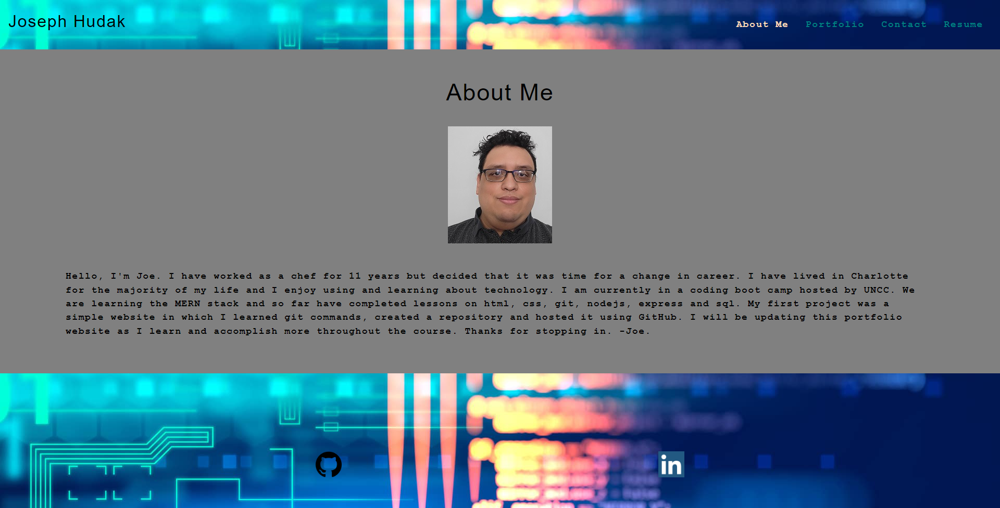

# React Portfolio

## Description

This is my personal portfolio

## table of Contents

- [Dependencies](#Dependencies)
- [Usage](#usage)
- [Credits](#credits)
- [License](#license)

## Dependencies

-react
-bootstrap
-email.js

## usage

[Click to be taken to my portfolio](https://joereactportfolio.herokuapp.com/)

## license

MIT

## Questions

GitHub: Magicalburritos

Email: hudakjoe@msn.com
